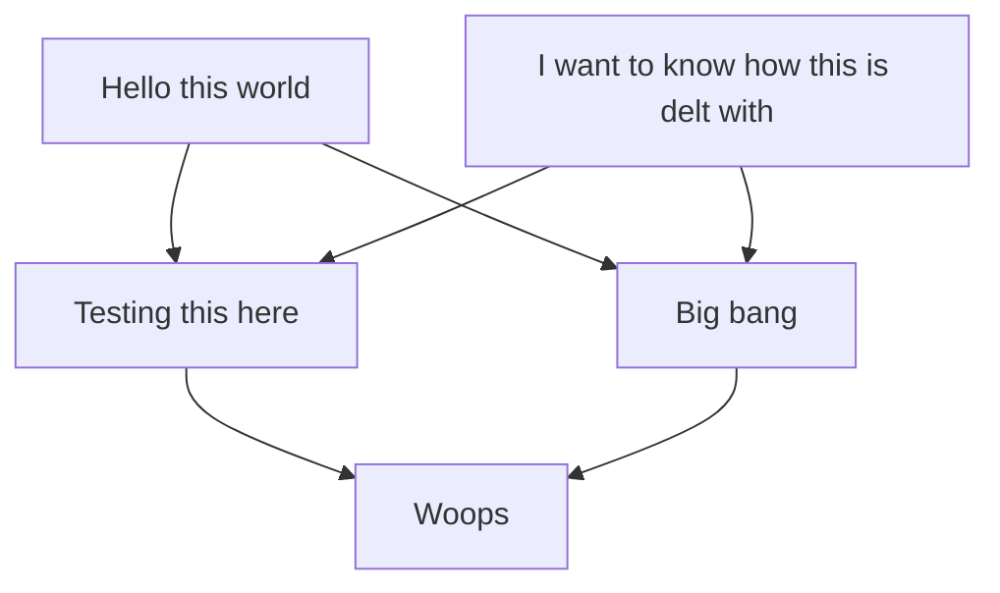
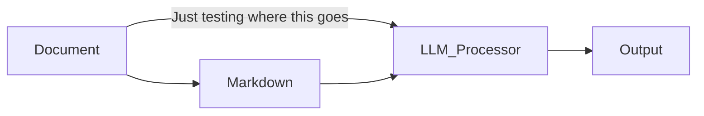
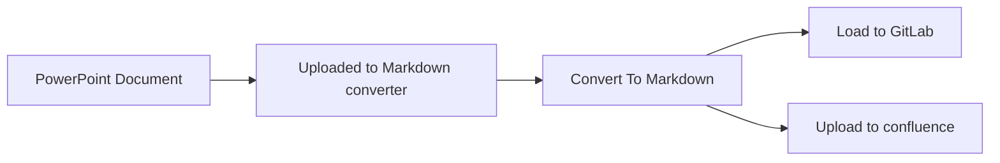

# presentation.pptx

*Converted from PowerPoint presentation*

<!-- Slide 1 -->

# Testing This Model

James Taylor

---

<!-- Slide 2 -->

# Trying to trouble shoot

Hello

This is another text box – it should pick up this 2nd

- surf link: [https://www.surf.com](https://www.surf.com)
- Named link: [Visit Example](#)

Testing getting this text from shapes

---

<!-- Slide 3 -->

# Reading order test

- Read this first
- Read this second
- Read this 4th
- Read this 5th
- Read this 6th

---

<!-- Slide 4 -->

# Smart Art



---

<!-- Slide 5 -->

# Long text test 1

- In today’s rapidly evolving **digital landscape**, the ability to adapt and learn continuously has become more **important** than ever. Whether you’re a **software engineer**, a **data analyst**, or a **creative professional**, staying updated with the latest tools and trends can give you a significant **competitive edge**. For instance, understanding **artificial intelligence** and **machine learning** concepts can open doors to **exciting** opportunities across industries. Similarly, mastering **cloud technologies** like AWS or Azure can significantly boost your **career trajectory**. But it’s not just about technical skills—developing **soft skills** like **communication**, **teamwork**, and **critical thinking** is equally essential. These are the attributes that help professionals stand out in **collaborative environments** and lead with **confidence**. Moreover, cultivating a growth mindset and maintaining **curiosity** will allow you to navigate challenges with **resilience**. Remember, the most successful people are not necessarily the ones who know the most, but those who are most willing to **learn and evolve**. So invest in yourself, build your **toolkit**, and take pride in the small wins along the way. The future belongs to those who are bold enough to embrace **change** and persistent enough to make **progress** every single day.

### Look at this

Moreover, cultivating a growth mindset and maintaining **curiosity** will allow you to navigate challenges with **resilience**. Remember, the most successful people are not necessarily the ones who know the most, but those who are most willing to **learn and evolve**. So invest in yourself, build your **toolkit**, and take pride in the small wins along the way. The future belongs to those who are bold enough to embrace **change** and persistent enough to make **progress** every single day.

---

<!-- Slide 6 -->

# Long text test 2

In today’s rapidly evolving **digital landscape**, the ability to adapt and learn continuously has become more *important* than ever. Whether you’re a **software engineer**, a **data analyst**, or a **creative professional**, staying updated with the latest tools and trends can give you a significant *competitive edge*. For instance, understanding **artificial intelligence** and **machine learning** concepts can open doors to *exciting* opportunities across industries. Similarly, mastering **cloud technologies** like AWS or Azure can significantly boost your *career trajectory*. But it’s not just about technical skills—developing **soft skills** like *communication*, *teamwork*, and *critical thinking* is equally essential. These are the attributes that help professionals stand out in **collaborative environments** and lead with *confidence*. Moreover, cultivating a growth mindset and maintaining **curiosity** will allow you to navigate challenges with *resilience*. Remember, the most successful people are not necessarily the ones who know the most, but those who are most willing to *learn and evolve*. So invest in yourself, build your **toolkit**, and take pride in the small wins along the way. The future belongs to those who are bold enough to embrace *change* and persistent enough to make *progress* every single day.

---

<!-- Slide 7 -->

# Test this

In today’s rapidly evolving **digital landscape**, the ability to adapt and learn continuously has become more *important* than ever. Whether you’re a **software engineer**, a data analyst, or a **creative professional**, staying updated with the latest tools and trends can give you a significant **competitive edge**. For instance, understanding **artificial intelligence** and **machine learning** concepts can open doors to *exciting* opportunities across industries. Similarly, mastering **cloud technologies** like AWS or Azure can significantly boost your **career trajectory**. But it’s not just about technical skills—developing **soft skills** like **communication**, **teamwork**, and **critical thinking** is equally essential. These are the attributes that help professionals stand out in **collaborative environments** and lead with **confidence**. Moreover, cultivating a growth mindset and maintaining **curiosity** will allow you to navigate challenges with **resilience**. Remember, the most successful people are not necessarily the ones who know the most, but those who are most willing to *learn and evolve*. So invest in yourself, build your **toolkit**, and take pride in the small wins along the way. The future belongs to those who are bold enough to embrace **change** and persistent enough to make **progress** every single day.

- Grouped 1
- Grouped 2
- Grouped 3

Hello there

---

<!-- Slide 8 -->

# Grouping test

This is some text  
after the grouping

Hello this is some text in  
a text box

**HOW DO YOU DEAL WITH THIS BOLD TEXT IN THE DOCUMENT 1 3 4 I WANT TO KNOW HOW IT READS 1**

- Grouped 1
- Grouped 2
- Grouped 3

---

<!-- Slide 9 -->

# Title – how do you with the main box

- This is the main box
- I want to see how this is dealt with
  - This is nested 2
    - Nested more 3
      - Nested even more 4

- This is the textbox
- I want to see how this is dealt with
  - This is nested 2
    - Nested more 3
    - Nested even more 4

**HOW DO YOU DEAL WITH THIS BOLD TEXT IN THE DOCUMENT  
I WANT TO KNOW HOW IT READS**

---

<!-- Slide 10 -->

# Font Formatting Test

### Textbox 1 Regular text with various formatting

- This is **bold text** that should convert to markdown
- This is *italic text* that should become emphasized
- This is ***bold and italic*** combined formatting
- This text has ~~strikethrough~~ formatting
- This text is `monospace/code` formatted
- This text has UPPERCASE and lowercase variations
- This text contains “smart quotes” and ‘apostrophes’

### Shapebox1

**Links to test:**

- Simple link: [https://www.example.com](https://www.example.com)
- Named link: [Visit Example](https://www.example.com)
- Email link: [contact@example.com](mailto:contact@example.com)
- Internal link: See Slide 5 for more details

---

<!-- Slide 11 -->

# Slide 4: Lists and Nesting Test

Textbox: nested list test for shapes

### Unordered Lists:
- First level item
- Another first level item
  - Second level nested item
  - Another second level item
    - Third level deeply nested
    - Another third level item
- Back to first level

### Shape: nested list test for shapes
- First level item
- Another first level item
  - Second level nested item
  - Another second level item
    - Third level deeply nested
    - Another third level item
- Back to first level

### Ordered Lists:
1. First numbered item
2. Second numbered item
   a. Sub-item with letter
   b. Another letter sub-item
3. Third main item

1. Second numbered item
   i. Sub-item with letter
   ii. Another letter sub-item
2. Third main item

### Mixed Lists:
4. Numbered item
   a. Bullet under numbered
   b. Another bullet
5. Second numbered
   a. Nested numbered
   b. Another nested numbered

---

<!-- Slide 12 -->

# Slide 4: Lists and Nesting Test

### Textbox: nested list test for shapes

**Unordered Lists:**
- First level item
- Another first level item
  - Second level nested item
  - Another second level item
    - Third level deeply nested
    - Another third level item
- Back to first level

**Ordered Lists:**
1. First numbered item
2. Second numbered item
   a. Sub-item with letter
   b. Another letter sub-item
3. Third main item

**Mixed Lists:**
4. Numbered item
   a. Bullet under numbered
   b. Another bullet
5. Second numbered
   a. Nested numbered
   b. Another nested numbered

### Shape: nested list test for shapes

**Unordered Lists:**
- First level item
- Another first level item
  - Second level nested item
  - Another second level item
    - Third level deeply nested
    - Another third level item
- Back to first level

==

### Shape: nested list test for shapes

1. Second numbered item
   i. Sub-item with letter
   ii. Another letter sub-item
2. Third main item

==

---

<!-- Slide 13 -->

# Slide 3: Check alt-text from images


---

<!-- Slide 14 -->

# Slide 5: Special Characters and Encoding

### Unicode and Special Characters:

- Mathematical symbols: α β γ δ Σ ∫ √ ∞ + ≤ ≥
- Currency symbols: $ € £ ¥ ₹ ₽ ฿
- Arrows and symbols: → ← ↑ ↓ ➔ ★ ☆ ♥ ♦ ♣ ♠
- Emojis: 🚀 📚 ✅ ❌ 💯 ♂️ 📈 💥

### International Text:

- Spanish: ¡Hola! ¿Cómo estás? Niño años
- French: Café naïve résumé façade
- German: Müller Größe Weiß
- Chinese: 你好世界 测试文档
- Arabic: مرحبا بالعالم
- Russian: Привет мир тест
- Japanese: こんにちは世界テスト

### Technical Characters:

- Code symbols: < > & { } [ ] | \ / @ # % ^ ~ `
- Mathematical: ± × ÷ ² ³ ¼ ½ ¾ π θ φ
- Punctuation: “Smart quotes” 'apostrophes' — em-dash — en-dash

---

<!-- Slide 15 -->

# Slide 6: Reading order test

- Read this fourth

- Read this third

- **Read this fifth**

- **Read this second**

- *Read this first*

---

<!-- Slide 16 -->

# Slide 7: Checking grouped items

Hello

This is another text box – it should pick up this 2nd

Test nested group test

Testing getting this text from shapes

---

<!-- Slide 17 -->

# Diagram testing



---

<!-- Slide 18 -->

# Shapebox1

### Links to test:

- surf link: [https://www.surf.com](https://www.surf.com)
- Named link: [Visit Example](https://www.example.com)
- Email link: [contact@example.com](mailto:contact@example.com)
- Internal link: See Slide 5 for more details

---

<!-- Slide 19 -->

# HLSD

```mermaid
graph TB
    A[Data upload<br>(RAG data,<br>evaluation,<br>prompts, etc)] --> B[Data Intergaration subsystem<br>(for RAG)]
    B --> C[Databases]
    C --> D[Quality evalution subsystem]
    D --> B
    B --> E[Serving Subsystem]
    E --> F[Application user]
```


---

<!-- Slide 20 -->

# Diagram testing

