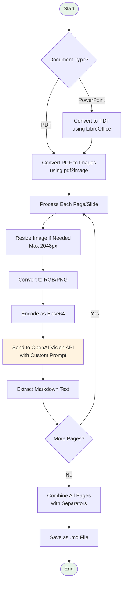
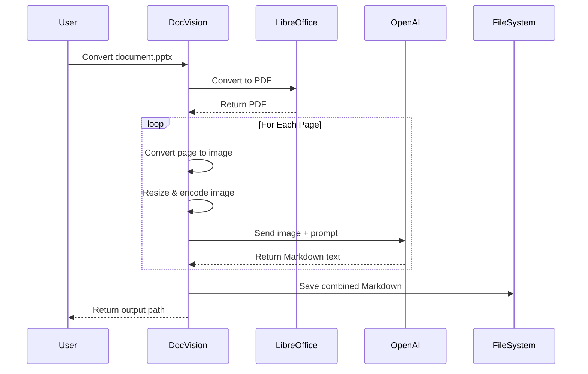
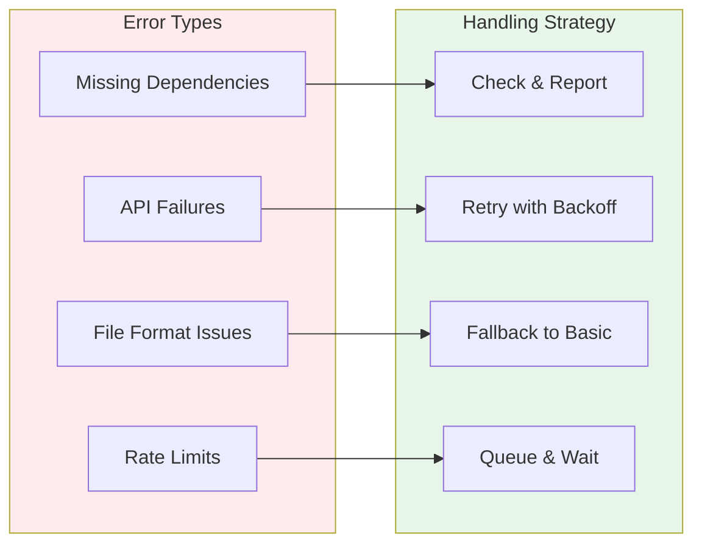
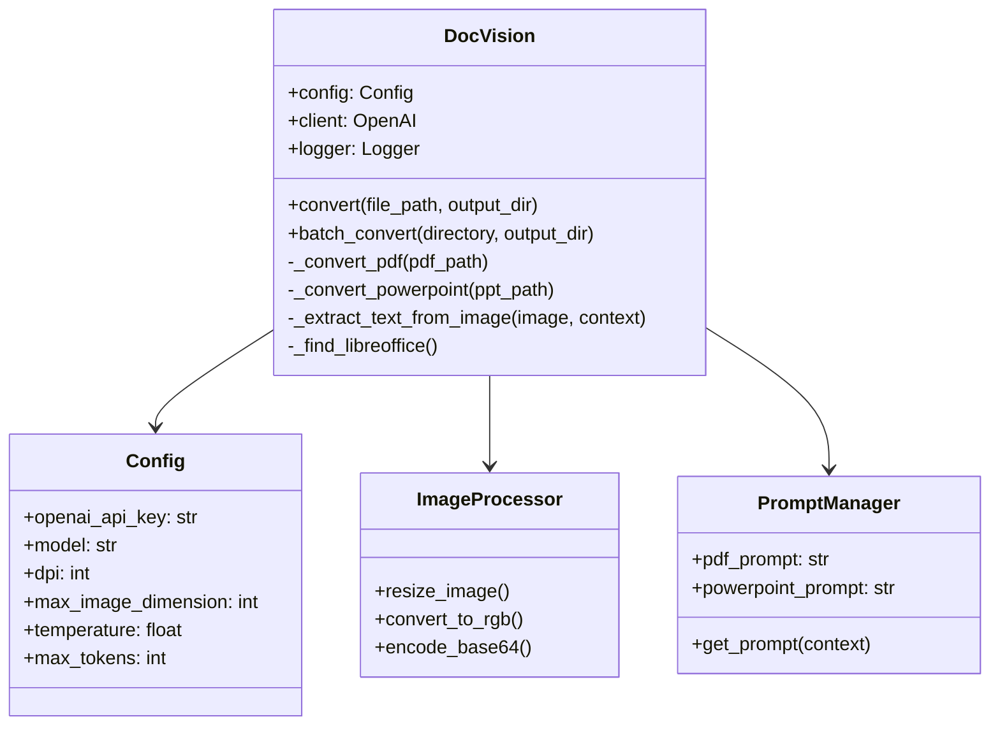
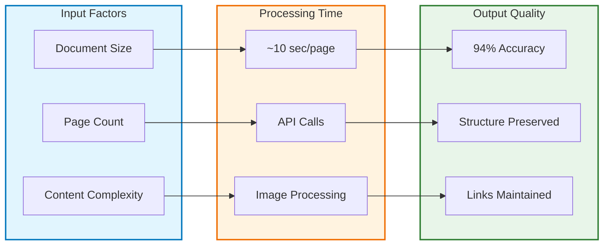
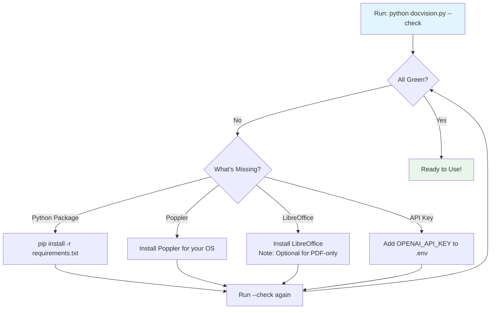

# DocVision - AI-Powered Document to Markdown Converter

[](https://www.python.org/downloads/)
[](LICENSE)
[](https://openai.com/)

## Overview

DocVision is an OCR-based document converter that transforms PDFs and PowerPoint presentations into clean, structured Markdown using OpenAI's Vision API. It solves the critical problem of extracting text from visual documents whilst maintaining correct reading order and structure.

**Key Features:**
- 📊 94% accuracy on real-world documents
- ⚡ 10 seconds per page/slide processing time
- 🔗 Preserves hyperlinks and formatting
- ✅ Maintains correct reading order (critical for compliance)

## How It Works

### High-Level Architecture

```mermaid
flowchart TB
    subgraph Input ["📁 Input Documents"]
        PDF[PDF Files]
        PPT[PowerPoint Files<br/>PPTX/PPT/ODP]
    end
    
    subgraph Processing ["⚙️ Processing Pipeline"]
        LibreOffice[LibreOffice<br/>Converter]
        Images[High-Res Images<br/>200 DPI]
        Vision[OpenAI GPT-4<br/>Vision API]
    end
    
    subgraph Output ["📄 Output"]
        MD[Markdown Files<br/>with Structure]
    end
    
    PDF --> Images
    PPT --> LibreOffice
    LibreOffice --> PDF
    Images --> Vision
    Vision --> MD
    
    style Input fill:#e1f5fe
    style Processing fill:#fff3e0
    style Output fill:#e8f5e9
```



### Detailed Processing Flow



### API Interaction Flow



### Error Handling Strategy



## Installation

### Prerequisites

- Python 3.8 or higher
- OpenAI API key
- Poppler (for PDF support)
- LibreOffice (for PowerPoint support - optional)

### System Dependencies Installation

```mermaid
flowchart TD
    OS{Operating System?}
    
    OS -->|macOS| Mac[brew install poppler<br/>brew install --cask libreoffice]
    OS -->|Linux| Linux[sudo apt-get install poppler-utils<br/>sudo apt-get install libreoffice]
    OS -->|Windows| Win[Download Poppler for Windows<br/>Download LibreOffice installer]
    
    Mac --> Python
    Linux --> Python
    Win --> Python
    
    Python[pip install -r requirements.txt]
    Python --> Config[Create .env file<br/>Add OPENAI_API_KEY]
    Config --> Ready[✅ Ready to Use]
    
    style Ready fill:#e8f5e9
```



### Quick Start

1. **Clone the repository:**
```bash
git clone https://gitlab.com/your-org/docvision.git
cd docvision
```

2. **Install Python dependencies:**
```bash
pip install -r requirements.txt
```

3. **Configure OpenAI API key:**

Create a `.env` file in the project root:
```env
OPENAI_API_KEY=your_api_key_here
OPENAI_MODEL=gpt-4o
LOG_LEVEL=INFO
DPI=200
MAX_WORKERS=1
```

4. **Check installation:**
```bash
python docvision.py --check
```

## Usage

### Command Line Interface

**Convert a single document:**
```bash
python docvision.py document.pdf
python docvision.py presentation.pptx
```

**Batch convert a directory:**
```bash
python docvision.py /path/to/documents/ --batch
```

**Specify output directory:**
```bash
python docvision.py document.pdf -o output/
```

### Python API

```python
from docvision import DocVision

# Initialise converter
converter = DocVision(api_key="your_api_key")

# Convert single file
output_path = converter.convert("presentation.pptx")

# Batch convert directory
results = converter.batch_convert("/path/to/documents/")
```

## Understanding the Code Structure



## Key Configuration Options

| Parameter | Default | Description |
|-----------|---------|-------------|
| `OPENAI_MODEL` | gpt-4o | OpenAI model to use |
| `DPI` | 200 | Image resolution for conversion |
| `MAX_IMAGE_DIMENSION` | 2048 | Maximum image size (pixels) |
| `TEMPERATURE` | 0.1 | AI creativity (0=deterministic) |
| `MAX_TOKENS` | 4000 | Maximum response length |

## Performance Characteristics



## Common Use Cases

- **Knowledge Base Migration**: Convert PowerPoint training materials to searchable Markdown
- **Documentation Extraction**: Extract technical specs from PDF manuals
- **AI Training Data**: Prepare documents for RAG (Retrieval-Augmented Generation) systems
- **Compliance Documentation**: Ensure accurate extraction for regulated content
- **Content Management**: Convert visual presentations to text-based systems

## Troubleshooting

### Dependency Check Workflow



## Limitations

- **Cost**: Uses OpenAI API (~$0.01-0.02 per page)
- **Internet Required**: Needs connection to OpenAI
- **Complex Layouts**: Best with standard document layouts
- **File Size**: Maximum 100MB per document

## Contributing

Contributions welcome! Areas for improvement:
- Support for additional document formats
- Local vision models for sensitive documents
- Improved table extraction
- Web interface for non-technical users

## License

MIT License - See [LICENSE](LICENSE) for details

---

*Built to bridge the gap between visual documents and AI-ready content.*