# DocVision Enterprise - Document to Markdown Converter with Enterprise LLM Support

[](https://www.python.org/downloads/)
[](LICENSE)
[](https://enterprise.ai/)

## Overview

DocVision Enterprise is a powerful document converter that transforms PDFs and PowerPoint presentations into clean, structured Markdown using your organisation's Enterprise LLM infrastructure. Built for environments requiring on-premises or private cloud AI processing, it maintains data sovereignty whilst delivering high-quality document conversion.

**Key Features:**
- 🏢 Enterprise LLM integration via JWT authentication
- 📊 High accuracy text extraction with structure preservation
- ⚡ Rate-limit aware with automatic 10-second pausing
- 🔗 Preserves hyperlinks, tables, and formatting
- 📈 Mermaid diagram generation from PowerPoint diagrams
- 🔄 Batch processing with resume capability
- ✅ PowerPoint enhancement mode for improved structure

## How It Works

### High-Level Architecture

```mermaid
flowchart TB
    subgraph Input ["📁 Input Documents"]
        PDF[PDF Files]
        PPT[PowerPoint Files<br/>PPTX/PPT/ODP]
    end
    
    subgraph Processing ["⚙️ Processing Pipeline"]
        LibreOffice[LibreOffice<br/>Converter]
        Images[High-Res Images<br/>200 DPI]
        EnterpriseLLM[Enterprise LLM<br/>JWT Auth]
        RateLimit[Rate Limiter<br/>10s pause]
    end
    
    subgraph Output ["📄 Output"]
        MD[Markdown Files<br/>with Structure]
        Mermaid[Mermaid Diagrams<br/>from Slides]
    end
    
    PDF --> Images
    PPT --> LibreOffice
    LibreOffice --> PDF
    Images --> RateLimit
    RateLimit --> EnterpriseLLM
    EnterpriseLLM --> MD
    EnterpriseLLM --> Mermaid
    
    style Input fill:#e1f5fe
    style Processing fill:#fff3e0
    style Output fill:#e8f5e9
    style EnterpriseLLM fill:#f3e5f5
```



### Detailed Processing Flow

```mermaid
flowchart TD
    Start([Start]) --> Config[Load JWT Token<br/>& Model URL]
    Config --> CheckType{Document Type?}
    
    CheckType -->|PDF| PDFPath[Convert PDF to Images<br/>using pdf2image]
    CheckType -->|PowerPoint| PPTPath[Convert to PDF<br/>using LibreOffice]
    
    PPTPath --> PDFPath
    PDFPath --> Loop[Process Each Page/Slide]
    
    Loop --> Resize[Resize Image if Needed<br/>Max 2048px]
    Resize --> Convert[Convert to RGB/PNG]
    Convert --> Base64[Encode as Base64]
    Base64 --> Pause[⏸️ Wait 10 seconds<br/>Rate Limit Protection]
    Pause --> API[Send to Enterprise LLM<br/>with Custom Prompt]
    
    API --> Extract[Extract Markdown Text<br/>Including Mermaid Diagrams]
    Extract --> More{More Pages?}
    
    More -->|Yes| Loop
    More -->|No| Enhance{Enhancement Mode?}
    
    Enhance -->|Yes| BatchEnhance[Batch Enhancement<br/>via Enterprise LLM]
    Enhance -->|No| Combine[Combine All Pages]
    
    BatchEnhance --> Combine
    Combine --> Save[Save as .md File]
    Save --> End([End])
    
    style Start fill:#e8f5e9
    style End fill:#e8f5e9
    style API fill:#f3e5f5
    style Pause fill:#fff3e0
```



### Enterprise LLM Integration

```mermaid
sequenceDiagram
    participant User
    participant DocVision
    participant Config
    participant EnterpriseLLM
    participant FileSystem
    
    User->>DocVision: Convert document.pptx
    DocVision->>Config: Load JWT_token.txt
    DocVision->>Config: Load model_url.txt
    Config-->>DocVision: Return credentials
    
    DocVision->>EnterpriseLLM: Test connection
    EnterpriseLLM-->>DocVision: Connection OK
    
    loop For Each Page
        DocVision->>DocVision: Convert page to image
        DocVision->>DocVision: Wait 10 seconds (rate limit)
        DocVision->>EnterpriseLLM: POST image + prompt<br/>Bearer: JWT Token
        EnterpriseLLM-->>DocVision: Return Markdown text
    end
    
    DocVision->>FileSystem: Save combined Markdown
    DocVision-->>User: ✅ Conversion complete
```



## Installation

### Prerequisites

- Python 3.8 or higher
- Enterprise LLM access (JWT token + endpoint URL)
- Poppler (for PDF support)
- LibreOffice (for PowerPoint support - optional)

### Quick Start

1. **Clone the repository:**
```bash
git clone https://github.com/your-org/docvision-enterprise.git
cd docvision-enterprise
```

2. **Install Python dependencies:**
```bash
pip install pdf2image pillow python-dotenv requests
```

3. **Install system dependencies:**

**macOS:**
```bash
brew install poppler
brew install --cask libreoffice
```

**Linux (Ubuntu/Debian):**
```bash
sudo apt-get install poppler-utils
sudo apt-get install libreoffice
```

**Windows:**
- Download and install [Poppler for Windows](https://blog.alivate.com.au/poppler-windows/)
- Download and install [LibreOffice](https://www.libreoffice.org/download/)

4. **Configure Enterprise LLM access:**

Create two files in the project root:

`JWT_token.txt`:
```
your_jwt_token_here
```

`model_url.txt`:
```
https://your-enterprise-llm-endpoint.com/v1/completions
```

5. **Verify installation:**
```bash
python docvision.py --check
```

## Usage

### Command Line Interface

**Convert a single document:**
```bash
python docvision.py document.pdf
python docvision.py presentation.pptx
```

**Batch convert a directory:**
```bash
python docvision.py /path/to/documents/ --batch
```

**Convert without enhancement (faster):**
```bash
python docvision.py presentation.pptx --no-enhance
```

**Specify output directory:**
```bash
python docvision.py document.pdf -o output/
```

**Quiet mode:**
```bash
python docvision.py document.pdf -q
```

### Python API

```python
from docvision import DocVision, Config

# Create custom configuration
config = Config()
config.pause_seconds = 10  # Rate limit protection
config.batch_size = 5      # Slides per enhancement batch

# Initialise converter
converter = DocVision(config)

# Convert single file
output_path = converter.convert("presentation.pptx", enhance=True)

# Batch convert directory
results = converter.batch_convert("/path/to/documents/")
```

## Understanding the Code Structure


## Key Configuration Options

| Parameter | Default | Description |
|-----------|---------|-------------|
| `pause_seconds` | 10 | Pause between API calls (rate limiting) |
| `batch_size` | 5 | Slides per enhancement batch |
| `dpi` | 200 | Image resolution for conversion |
| `max_image_dimension` | 2048 | Maximum image size (pixels) |
| `temperature` | 0.1 | LLM creativity (0=deterministic) |
| `max_tokens` | 4000 | Maximum response length |

## PowerPoint Conversion Features

### Enhanced Extraction Capabilities

The converter uses sophisticated prompts to:
- Extract ALL visible text without missing content
- Generate Mermaid diagrams from visual diagrams
- Preserve table structures with proper formatting
- Maintain bullet point hierarchies with correct indentation
- Format code blocks and technical content appropriately
- Include all links, captions, and annotations

### Structure Rules

- **One `#` header per slide** (main title)
- **`###` for subheadings** (never `##`)
- **2-space indentation** for nested bullets
- **Mermaid code** for diagrams with text boxes and arrows
- **Proper table syntax** with `|` separators

## Performance Characteristics

```mermaid
graph LR
    subgraph Processing["Processing Time"]
        A[10 sec pause/image]
        B[~15-20 sec total/page]
        C[Batch: N × 20 sec]
    end
    
    subgraph Quality["Output Quality"]
        D[Complete text extraction]
        E[Structure preservation]
        F[Diagram conversion]
    end
    
    subgraph RateLimits["Rate Limit Protection"]
        G[Automatic pausing]
        H[Token cap compliance]
        I[Stable processing]
    end
    
    A --> G
    B --> E
    C --> H
    
    style Processing fill:#fff3e0
    style Quality fill:#e8f5e9
    style RateLimits fill:#f3e5f5
```



## Common Use Cases

- **Secure Document Processing**: Keep sensitive documents within your infrastructure
- **Compliance Documentation**: Process regulated content without external APIs
- **Training Material Migration**: Convert PowerPoint training to Markdown knowledge bases
- **Technical Documentation**: Extract specs from PDF manuals with diagram preservation
- **Batch Processing**: Convert entire document libraries with rate limit protection

## Troubleshooting

### Common Issues and Solutions

| Issue | Solution |
|-------|----------|
| JWT token error | Check `JWT_token.txt` exists and contains valid token |
| Connection timeout | Verify `model_url.txt` contains correct endpoint |
| Rate limit errors | Pause time automatically handles this (10 seconds) |
| LibreOffice not found | Install LibreOffice or use `--check` to verify |
| Poor extraction quality | Ensure DPI is set to 200 or higher |

### Dependency Check

```bash
python docvision.py --check
```

This will verify:
- ✅ Python version and packages
- ✅ Poppler installation
- ✅ LibreOffice availability
- ✅ JWT token configuration
- ✅ Model URL configuration

## Enterprise Considerations

### Security

- **No external API calls** - All processing via your Enterprise LLM
- **JWT authentication** - Secure token-based access
- **Local processing** - Images never leave your infrastructure

### Rate Limiting

The 10-second pause between images ensures:
- Token consumption stays within limits
- API endpoints aren't overwhelmed
- Consistent processing without failures
- Predictable batch processing times

### Batch Processing

For large document sets:
- Automatic pausing prevents overload
- Progress tracking with file counters
- Error handling continues processing
- Summary statistics after completion

## Limitations

- **Processing Speed**: 10-second pause adds to processing time
- **LibreOffice Dependency**: Required for PowerPoint conversion
- **Image Quality**: Complex layouts may need manual review
- **File Size**: Maximum 100MB per document

## Contributing

Areas for improvement:
- Support for additional document formats (Word, Excel)
- Parallel processing with rate limit management
- Web interface for non-technical users
- Resume capability for interrupted batch jobs
- Custom prompt templates per document type

## License

MIT License - See [LICENSE](LICENSE) for details

---

*Built for enterprise environments requiring secure, on-premises document processing with rate limit awareness.*